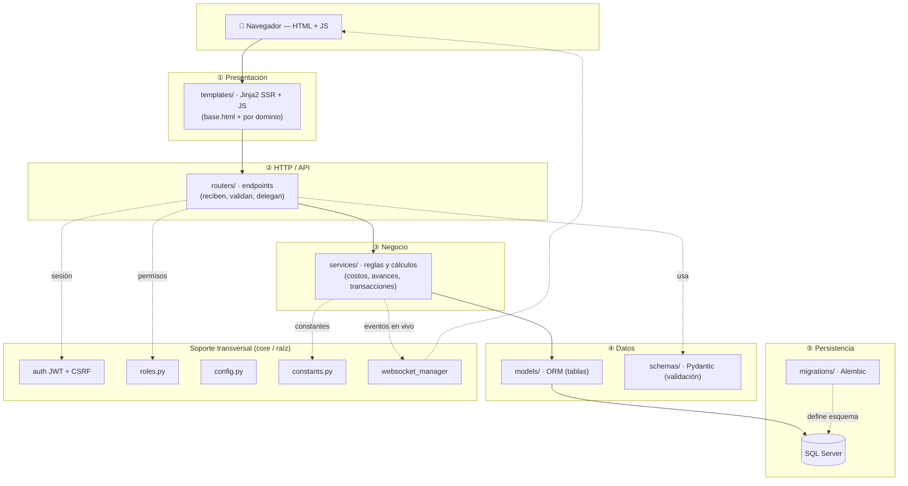
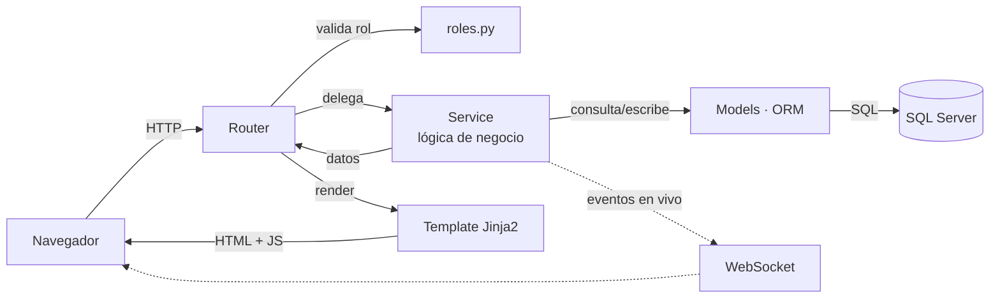

# Arquitectura — samitex-planta

Sistema web interno de gestión de planta de corte (MES/ERP ligero para manufactura textil).
Monolito **FastAPI** que sirve **API + vistas SSR (Jinja2)**, sobre **SQL Server** con **SQLAlchemy 2.0** y migraciones **Alembic**.

---

## 1. Vista general de carpetas

```
samitex-planta/
├── app/            # La aplicación (único código de runtime)
├── migrations/     # Migraciones de esquema de BD (Alembic) — fuente de verdad del esquema
├── tests/          # Pruebas automáticas (pytest, SQLite en memoria)
├── static/         # CSS/JS/imágenes + documentos servidos (uploads del catálogo)
├── uploads/        # Documentos subidos por usuarios (OF); no versionado
├── scripts/        # Utilidades manuales (NO son parte del runtime)
│   ├── seed/           # cargas de datos de prueba (catálogo, piezas, HDC)
│   ├── mantenimiento/  # borrar/limpiar/reset de OFs (destructivos)
│   └── sql/            # consultas SQL sueltas
├── docs/           # Documentación
│   ├── analisis/       # análisis funcionales/técnicos
│   ├── planes/         # planes y diseños
│   ├── entregables/    # informes (docx/pptx/xlsx)
│   └── legacy-db/       # método viejo de crear la BD por SQL manual (histórico)
└── (raíz) alembic.ini · pytest.ini · requirements*.txt · README.md · .env.example · .gitignore
```

Regla mental: **`app/` es la aplicación; `migrations/` define la BD; `tests/` la protege; `scripts/` + `docs/` son apoyo** que no afecta al funcionamiento.

---

## 2. `app/` — arquitectura por capas

```
app/
├── main.py         # Arranque: crea FastAPI, monta routers y estáticos
├── config.py       # Configuración (lee .env: BD, secrets, tokens)
├── constants.py    # Valores fijos de negocio (fases, clases SAP, topes…)
├── roles.py        # Matriz central de roles (quién puede qué)
│
├── core/           # Infraestructura transversal: auth (JWT), csrf, websocket_manager, templates
├── database/       # Conexión a SQL Server + Base declarativa de SQLAlchemy
│
├── models/         # TABLAS (ORM): of, pieza, fase, paquete, catalogo, trazo,
│                   #   usuario, planta, parametro, ingenieria, curva_tallas
├── schemas/        # Validación de entrada/salida (Pydantic)
├── services/       # LÓGICA DE NEGOCIO (sin HTTP): corte_service, paquete_service,
│                   #   of_service, of_import_service (SAP), gate_service, trazo_service, semaforo_service
├── routers/        # ENDPOINTS HTTP: of, corte, paquetes, catalogo, hoja_costos, comercial,
│                   #   curvas, plantas, supervisor, trazos, ingenieria, admin, auth, dashboard, ws
└── templates/      # VISTAS Jinja2 (SSR) + JS, por dominio:
                    #   base.html (layout+nav) · of/ · corte/ · catalogo/ · comercial/ ·
                    #   plantas/ · supervisor/ · dashboard/ · admin/ · auth/ · pdf/
```

### Diagrama por capas



Se lee de arriba hacia abajo: cada capa **solo habla con la de abajo**. La caja de **soporte transversal** (seguridad, roles, config, constantes, WebSocket) la usan varias capas pero no forma parte del flujo principal.

### Responsabilidad de cada capa

| Capa | Rol | No debe… |
|---|---|---|
| **routers/** | Puerta HTTP: recibe la petición, valida rol (`roles.py`), delega al service, devuelve template/JSON | …tener lógica de negocio pesada |
| **services/** | El cerebro: reglas de negocio, cálculos (costos, avances), transacciones | …conocer HTTP ni request/response |
| **models/** | La forma de los datos (tablas y relaciones) | …tener lógica de proceso |
| **schemas/** | Contrato de datos de entrada (Pydantic) | — |
| **templates/** | La pantalla (HTML + JS); usa helpers de `base.html` | …calcular datos de negocio |
| **core/ · config · roles · constants** | Soporte transversal (seguridad, config, permisos, constantes) | — |

---

## 3. Flujo de una petición



**Ejemplo real (cola de Calidad):** el navegador pide `/paquetes/calidad` → el **router** `paquetes.py` valida el rol con `roles.py` → llama al **service** `paquete_service.py` → que lee los **models** `paquete`/`of` desde **SQL Server** → devuelve el **template** `of/calidad_cola.html`, que se pinta. Los cálculos viven en el service, nunca en el router ni el template.

---

## 4. Datos y migraciones

- El **esquema** de la BD lo define **Alembic** (`migrations/versions/*.py`). Cada cambio de tabla/columna es una migración; `alembic upgrade head` deja la BD al día. **Es la fuente de verdad** — el método SQL manual antiguo quedó archivado en `docs/legacy-db/`.
- Los **modelos** (`app/models/`) describen las tablas en Python; deben mantenerse en sync con las migraciones.

---

## 5. Convenciones

- **Nombres:** `snake_case` para módulos, funciones y columnas; templates agrupados por dominio.
- **Permisos:** todo control de acceso pasa por `app/roles.py` (conjuntos de roles) + validación en el router; los endpoints que mutan devuelven `403` si el rol no aplica.
- **Scripts:** los de `scripts/` se ejecutan **desde la raíz del repo** (hacen `from app...`), p.ej. `python scripts/seed/seed_schellenger.py`.
- **Tests:** `pytest -q` corre las 214 pruebas con SQLite en memoria; se ejecuta tras cada cambio.

---

## 6. Integraciones

- **SAP (export COIS):** importación de OFs vía Excel → `services/of_import_service.py`.
- **PDF:** ficha de OF con `xhtml2pdf` (`routers/pdf_report.py` + `templates/pdf/`).
- **Excel:** lectura de HDC y catálogo con `openpyxl`.
- **Telegram (opcional):** bot de notificaciones.
- **Tiempo real:** WebSockets para reflejar avances en los cockpits.
