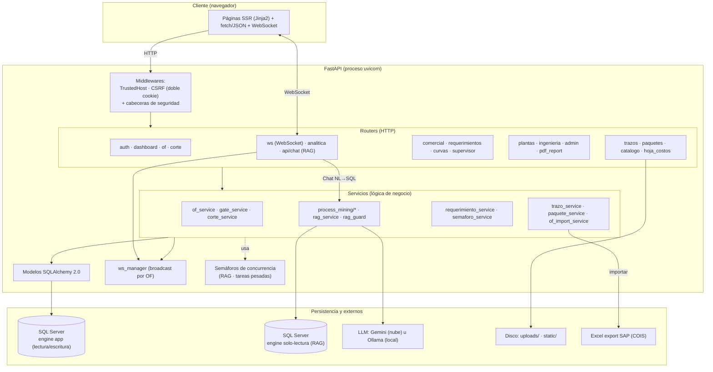

# Arquitectura — Samitex Planta

## 1. Visión general

Monolito **FastAPI** con renderizado del lado del servidor (Jinja2) sobre
**SQL Server**. La aplicación sigue una separación clásica por capas: routers
(HTTP) → servicios (lógica de negocio) → modelos ORM (persistencia). El driver
de base de datos (`pyodbc`) es **síncrono**, y por eso los endpoints de negocio
son funciones `def` que FastAPI ejecuta en su *threadpool* (no bloquean el event
loop). El código `async` se reserva para middlewares, WebSocket y manejadores de
error, que no hacen I/O bloqueante.

## 2. Diagrama de componentes

## 3. Capas y responsabilidades

- **Routers (`app/routers/`)** — Adaptan HTTP a llamadas de servicio: validan
  entrada (Pydantic), resuelven el usuario y su rol, y devuelven HTML (plantillas)
  o JSON. No contienen lógica de negocio pesada. Ver [API_ENDPOINTS.md](API_ENDPOINTS.md).
- **Servicios (`app/services/`)** — Concentran las reglas: gates de activación de
  OF, motor de fases de corte, placas/trazos, numeración en bultos, calidad y
  reprocesos, importación SAP, requerimientos, semáforo por fecha, y la analítica
  (process mining + RAG). Ver [DOMINIO_Y_FLUJO.md](DOMINIO_Y_FLUJO.md).
- **Modelos (`app/models/`)** — Mapeo ORM a las tablas de SQL Server. Ver
  [BASE_DE_DATOS.md](BASE_DE_DATOS.md).
- **Núcleo (`app/core/`)** — Autenticación/JWT, CSRF, plantillas, `ws_manager`,
  helpers de concurrencia y de tareas en segundo plano.
- **Config (`app/config.py`)** — Ajustes por entorno (Pydantic Settings). Ver
  [CONFIGURACION.md](CONFIGURACION.md).

## 4. Flujo request-response

1. La petición entra por los middlewares: **TrustedHost** valida la cabecera
   `Host`; **CSRF** valida el token de doble cookie firmada en métodos mutantes y
   añade cabeceras de seguridad (`X-Content-Type-Options`, `X-Frame-Options`,
   `Referrer-Policy`).
2. El router resuelve `get_current_user` (cookie `samitex_token` o `Bearer`) y
   comprueba el rol contra los conjuntos `ROLES_*`.
3. El handler (síncrono) delega en un servicio; el servicio usa la sesión de BD
   inyectada por `get_db` (abierta/cerrada por request).
4. Se devuelve HTML o JSON. Si la acción cambia el estado de una OF, se emite una
   notificación WebSocket a los suscriptores de esa OF.

## 5. Tiempo real (WebSocket)

`ws_manager` mantiene en memoria los suscriptores por canal (`of_{numero}`). Los
endpoints síncronos publican avisos con `notify_of(...)`, que agenda el broadcast
en el event loop principal mediante `run_coroutine_threadsafe` — un patrón
sync→async que **no bloquea** la petición y **no arrastra** la sesión de BD (solo
viaja información primitiva). El keepalive de las conexiones lo maneja uvicorn a
nivel de protocolo.

> El estado de suscriptores vive **en memoria del proceso**: con varios workers
> habría que compartirlo (Redis) para que un broadcast llegue a todos.

## 6. Analítica

- **Process Mining (`app/services/process_mining/`)** — Construye un *event log*
  (caso = bulto, con las fases de tela F1–F3 antepuestas), y calcula el
  Directly-Follows Graph, cuellos de botella, KPIs, ruta crítica (CPM con
  paralelismo de bultos) y datos de animación. Todo en Python, solo lectura.
- **Chat analítico RAG (Text-to-SQL)** — Traduce lenguaje natural a SQL de solo
  lectura sobre un *whitelist* de tablas/vistas de negocio. Corre contra un
  **engine de BD independiente de solo lectura** y pasa por barreras de seguridad
  (`rag_guard`) antes de ejecutar. Ver [SEGURIDAD.md](SEGURIDAD.md).

## 7. Concurrencia y estabilidad

- Endpoints de negocio `def` → threadpool (no bloquean el loop pese al driver
  síncrono). Pool de BD 20+30=50 conexiones, dimensionado por encima del
  threadpool (40).
- **Semáforos** acotan el trabajo intensivo: `RAG_MAX_CONCURRENCIA` (consultas al
  LLM) y `HEAVY_MAX_CONCURRENCIA` (PDF, import Excel, process mining); el exceso
  responde 429 en vez de saturar el proceso.
- Trabajo pesado (import SAP, reportes) corre **inline** en el request; para
  escalar se movería a una cola/worker. Detalle en `docs/DESPLIEGUE_CONCURRENCIA.md`
  y `docs/TAREAS_EN_FONDO.md`.

## 8. Integración con SAP

Las OFs se importan desde el **export Excel de la transacción COIS**. El servicio
`of_import_service` normaliza encabezados, mapea columnas SAP a campos internos,
enlaza cada OF con su prenda del catálogo por `material_sap` y aplica la
configuración de **clase de orden** (ZP41 Institución, ZP42 Marca, ZP43
Reprocesos, ZP44 Servicios) para decidir tipo de cliente y gates.
