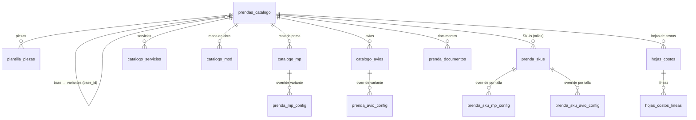
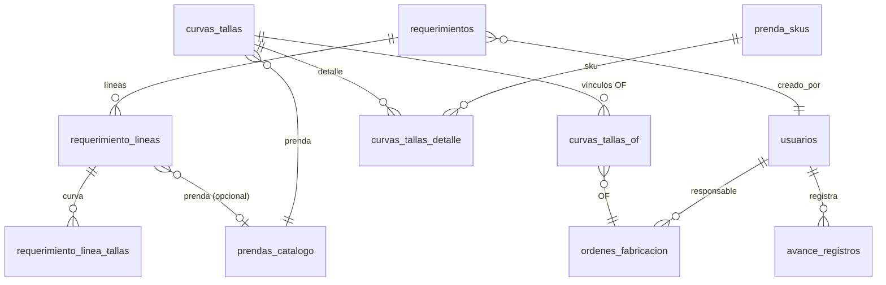

# Base de datos — Samitex Planta

Motor: **Microsoft SQL Server**. ORM: **SQLAlchemy 2.0** (modelos en
`app/models/`). Migraciones: **Alembic**. Todos los modelos usan `id` entero como
PK salvo `parametros_sistema` (PK = `clave`).

Dos nodos concentran el esquema:

- **`ordenes_fabricacion`** — la OF, referenciada por ~15 tablas de producción.
- **`prendas_catalogo`** — el catálogo, con **auto-referencia** `base_id`
  (jerarquía base→variante) y del que cuelgan ficha, materiales, avíos, SKUs, etc.
- **`prenda_skus`** — la variante por talla; muy referenciada (distribución,
  fases, avances, trazos, paquetes, curvas).

> Nota de diseño: la **herencia** de ficha (piezas, materiales, avíos, servicios,
> mano de obra) de base→variante se resuelve en Python (propiedades `*_efectivos`),
> **no** con FKs adicionales en la BD.

---

## 1. Diagrama ER — Núcleo OF / Producción

```mermaid
erDiagram
    ordenes_fabricacion ||--o{ of_piezas : "piezas"
    ordenes_fabricacion ||--o{ of_talla_distribucion : "distribución tallas"
    ordenes_fabricacion ||--o{ of_fases_estado : "estado por fase"
    ordenes_fabricacion ||--o{ of_fase_tiempos : "tiempos por fase"
    ordenes_fabricacion ||--o{ of_fase_paradas : "paradas"
    ordenes_fabricacion ||--o{ avance_registros : "avances"
    ordenes_fabricacion ||--o{ of_trazos : "placas/trazos"
    ordenes_fabricacion ||--o{ of_paquetes : "bultos"
    ordenes_fabricacion ||--o{ documentos_of : "documentos"
    ordenes_fabricacion ||--o{ of_numeracion_reaperturas : "reaperturas"
    ordenes_fabricacion }o--|| prendas_catalogo : "prenda"
    ordenes_fabricacion }o--o| plantas_externas : "tercerización"
    ordenes_fabricacion }o--|| usuarios : "responsable"

    of_piezas ||--o{ of_fases_estado : "por pieza"
    of_piezas ||--o{ of_paquetes : "bultos"
    fases_catalogo ||--o{ of_fases_estado : "fase"
    fases_catalogo ||--o{ of_fase_tiempos : "fase"
    prenda_skus ||--o{ of_talla_distribucion : "sku"
    prenda_skus ||--o{ of_fases_estado : "sku"

    of_trazos ||--o{ of_trazo_tallas : "tallas"
    of_trazos ||--o{ of_trazo_movimientos : "tendido/corte"
    prenda_skus ||--o{ of_trazo_tallas : "sku"

    of_paquetes ||--o{ of_paquete_eventos : "eventos"
    of_paquetes ||--o{ of_paquete_rechazos : "rechazos"
    motivos_rechazo ||--o{ of_paquete_rechazos : "motivo"
    of_paquete_rechazos ||--o{ of_reproceso_hitos : "hitos"

    plantas_externas ||--o{ terc_recepciones : "recepciones"
    plantas_externas ||--o{ terc_historial_fechas : "historial"
    plantas_externas ||--o{ terc_subproceso_log : "subprocesos"
    ordenes_fabricacion ||--o{ terc_recepciones : "recepciones"
    ordenes_fabricacion ||--o{ terc_subproceso_log : "subprocesos"
```

### Tablas del núcleo

| Tabla | Rol | FKs principales |
|---|---|---|
| `ordenes_fabricacion` | OF (hub). Estados BORRADOR/ACTIVA/EN_PROCESO/COMPLETADA/ANULADA; campos SAP; tercerización; candado de numeración | `prenda_catalogo_id`, `planta_id`, `responsable_id`, `hoja_numeracion_cerrada_por` |
| `of_piezas` | Piezas de la OF (tela/etc.) | `of_id` |
| `of_talla_distribucion` | Cantidad por SKU (talla) dentro de la OF | `of_id`, `sku_id` · UQ(of_id,sku_id) |
| `fases_catalogo` | Catálogo de fases F1–F9 (llave lógica `fase_id`) | — |
| `of_fases_estado` | Estado por pieza×fase (y ×talla si aplica) | `of_id`, `pieza_id`, `fase_id`, `sku_id` · UQ(of,pieza,fase,sku) |
| `of_fase_tiempos` | Inicio/fin programado y real por fase | `of_id`, `fase_id` · UQ(of,fase) |
| `of_fase_paradas` | Paradas por fase (con OF de emergencia) | `of_id`, `fase_id`, `of_emergencia_id`, `usuario_id` |
| `avance_registros` | Bitácora de avances (reversible) | `of_id`, `pieza_id`, `fase_id`, `sku_id`, `usuario_id` |
| `of_trazos` | Placas/marker (fases de tela F1–F3) | `of_id` |
| `of_trazo_tallas` | Tallas dibujadas en la placa | `trazo_id`, `sku_id` · UQ(trazo,sku) |
| `of_trazo_movimientos` | Auditoría de tendido/corte | `trazo_id`, `usuario_id` |
| `of_paquetes` | Bultos numerados | `of_id`, `sku_id`, `pieza_id` · UQ(of,pieza,numero) |
| `of_paquete_eventos` | Transiciones de estado del bulto | `paquete_id`, `usuario_id` |
| `motivos_rechazo` | Catálogo de defectos (CR01…CR53) | — (`codigo` UNIQUE) |
| `of_paquete_rechazos` | Rechazos de calidad por bulto | `paquete_id`, `motivo_id`, `usuario_id` |
| `of_reproceso_hitos` | Hitos del reproceso de un rechazo | `rechazo_id`, `usuario_id` |
| `of_numeracion_reaperturas` | Reaperturas del candado de numeración | `of_id`, `usuario_id` |
| `documentos_of` / `auditoria_documento_of` | Documentos de gate y su auditoría | `of_id`, `usuario_id` |
| `plantas_externas` | Talleres de tercerización | — |
| `terc_recepciones` / `terc_historial_fechas` / `terc_subproceso_log` | Envíos/recepciones/subprocesos tercerizados | `of_id`, `planta_id`, `usuario_id` |

---

## 2. Diagrama ER — Catálogo de prendas

### Tablas del catálogo

| Tabla | Rol |
|---|---|
| `prendas_catalogo` | Prenda BASE o VARIANTE (self-FK `base_id`; `material_sap` UNIQUE; CHECK: una BASE no puede tener padre). `hereda_ficha` activa la herencia viva |
| `plantilla_piezas` | Piezas que componen la prenda |
| `catalogo_mp` | Materia prima (tela/entretela/forro/accesorio) con consumo y factores |
| `catalogo_avios` | Avíos por sección (COSTURA/ACABADOS/EMBALAJE) |
| `catalogo_servicios` | Servicios de terceros (lavandería, bordado, estampado…) |
| `catalogo_mod` | Mano de obra directa por operación (corte/costura/acabado) |
| `prenda_skus` | Variante por talla (nodo muy referenciado por producción) |
| `prenda_mp_config` / `prenda_avio_config` | Override por variante (excluir / cambiar consumo) |
| `prenda_sku_mp_config` / `prenda_sku_avio_config` | Override por talla |
| `hojas_costos` / `hojas_costos_lineas` | Hoja de costos (BORRADOR/APROBADA) con snapshot de precios |
| `precios_historicos` | Historial de cambios de precio de MP/avíos |
| `prenda_documentos` | Documentos de la prenda |

> `hojas_costos_lineas.item_id` y `precios_historicos.item_id` son FKs **lógicas**
> (apuntan a `catalogo_mp`/`catalogo_avios` según `tipo`), no declaradas en la BD.

---

## 3. Diagrama ER — Comercial, curvas y usuarios

| Tabla | Rol |
|---|---|
| `requerimientos` / `requerimiento_lineas` / `requerimiento_linea_tallas` | Requerimiento comercial (Fase 1): cabecera + líneas + curva por tallaje A/B/C |
| `curvas_tallas` / `curvas_tallas_detalle` | Curva de tallas reutilizable por prenda |
| `curvas_tallas_of` | Puente N:M curva↔OF (UQ curva,of) |
| `usuarios` | Cuentas y rol (`RolEnum`); `email`/`username` UNIQUE |
| `tokens_revocados` | Lista negra de JTI de JWT (logout) |
| `parametros_sistema` | Config global clave-valor (PK = `clave`) |
| `ing_*` (9 tablas) | Registros de ingeniería industrial (SAM, paradas, muestreo, tendido, calidad/FPY, OLE, fusionado, habilitado, Ishikawa). `of_id` FK opcional |

---

## 4. Enums persistidos en BD

Solo estos se almacenan como `Enum` de SQLAlchemy; el resto de "estados" son
`String` con listas de valores válidos en `app/constants.py`.

- `EstadoOF` — BORRADOR / ACTIVA / EN_PROCESO / COMPLETADA / ANULADA.
- `TipoClienteEnum` — INSTITUCION / MARCA.
- `EstadoDocsEnum` — PENDIENTE / EN_DOCUMENTACION / COMPLETA.
- `RolEnum` — 15 roles (ver [SEGURIDAD.md](SEGURIDAD.md)).

## 5. Migraciones

El esquema se versiona con **Alembic** (`migrations/versions/`). Al arrancar, la
app siembra de forma idempotente el catálogo de fases (`fases_catalogo`) en el
handler de startup. No editar tablas a mano en producción: usar migraciones.
