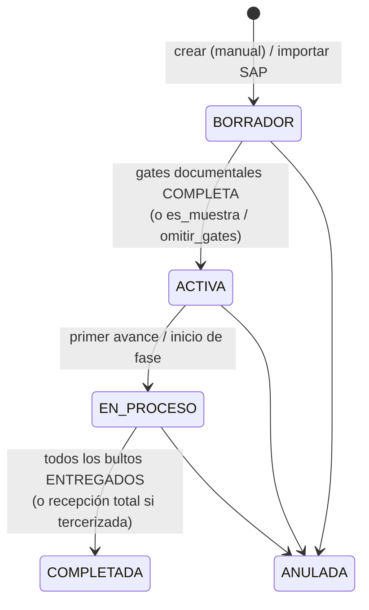
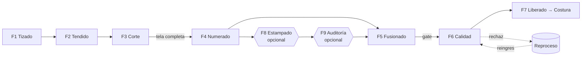
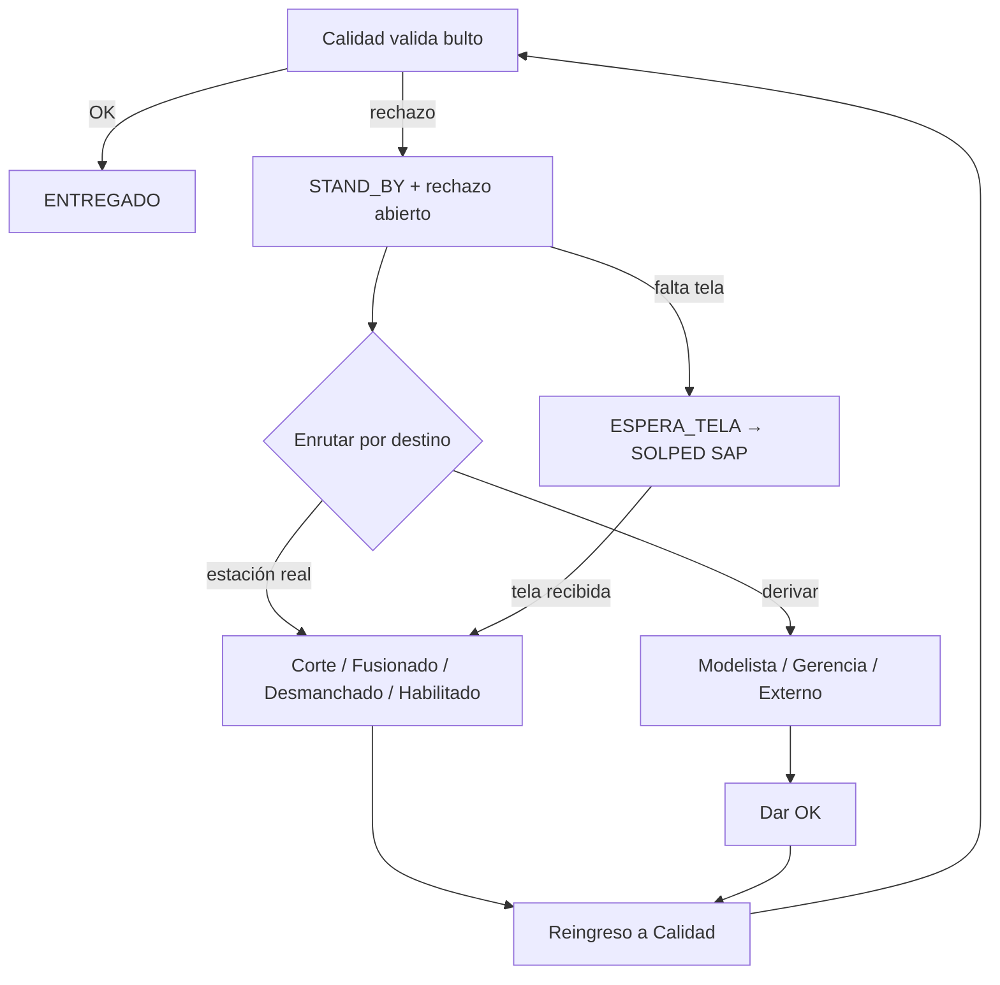

# Dominio y flujo de proceso — Samitex Planta

El sistema modela el **Proceso de Corte** de una planta textil: desde que llega
un pedido/OF hasta que las prendas cortadas se **habilitan (entregan) a Costura**.

## 1. Ciclo de vida de la Orden de Fabricación (OF)

Estados (`EstadoOF`): **BORRADOR → ACTIVA → EN_PROCESO → COMPLETADA**, con
**ANULADA** como estado terminal alterno.

### Creación

1. **Manual** — desde los formularios de OF (rol Planeamiento).
2. **Import SAP** — `of_import_service` lee el export Excel de la transacción
   **COIS** (una OF por fila). Nace en BORRADOR / `estado_docs=PENDIENTE`. La
   **clase de orden** SAP define tipo de cliente y gates:
   - `ZP41` → Institución (con gates)
   - `ZP42` → Marca (con gates)
   - `ZP43` → Reprocesos (sin gates)
   - `ZP44` → Servicios de terceros (sin gates)
   El cliente lo digita el planeador (SAP no lo trae). El enlace a la prenda del
   catálogo es por `material_sap`.

### Gates documentales (activación)

`gate_service` calcula qué requisitos habilitan pasar la OF a ACTIVA. Hay dos
cadenas, y cada gate tiene roles autorizados por tipo de cliente:

- **Cadena 1:** FICHA_TECNICA → HOJA_COSTOS → SOLPED_PRENDA.
- **Cadena 2 (desde MUESTRA_APROBADA):** rama SAP (SOLPED_MP → ORDEN_COMPRA →
  CONFIRMACION_STOCK) y rama técnica (REPORTE_TALLAS → MOLDES_LECTRA).

Las OFs `es_muestra` o con `omitir_gates` se activan sin gates (útil para pruebas;
`omitir_gates` solo lo pueden marcar roles de prueba).

## 2. Fases del proceso de corte

`ORDEN_FASES = [F1, F2, F3, F4, F8, F9, F5, F6, F7]`:

| Fase | Nombre | Ámbito | Notas |
|---|---|---|---|
| **F1** | Tizado | Tela (placas) | Eficiencia del trazo (objetivo 85–87%) |
| **F2** | Tendido | Tela (placas) | Registro de capas tendidas |
| **F3** | Corte | Tela (placas) | Registro de capas cortadas |
| **F4** | Numerado | Pieza×talla | Genera bultos (hoja de numeración) |
| **F8** | Estampado/Bordado | Opcional | Solo si `estampado_activo` |
| **F9** | Auditoría calidad | Opcional | Acompaña a F8 |
| **F5** | Fusionado | Pieza×talla | Solo piezas con `fusionado=True` |
| **F6** | Calidad | Pieza×talla | Valida bultos; puerta de reproceso |
| **F7** | Liberado (Habilitado) | Pieza×talla | Entrega final a Costura |

**Reglas de avance** (`corte_service`): las fases avanzan en **cascada** — una
fase no puede superar la cantidad de la anterior. Hay una **frontera tela→talla**
en F3→F4 (exige la tela completa antes de numerar) y un **gate F5→F6** (Calidad
exige Fusionado completo en piezas fusionables). F1–F3 se gestionan por placas;
F4–F7 por pieza×talla cuando `corte_por_talla` está activo.

## 3. Placas / trazos (fases de tela)

`trazo_service` gestiona las placas (marker): una placa combina **capas × veces**
por talla. Metros ≈ capas × largo. Se valida el **tope de capas** de la máquina
(`max_capas` por OF, o 80 global) y la **cobertura** contra la curva de tallas.
El tendido y el corte se registran por partes con auditoría
(`of_trazo_movimientos`). Cuando todas las placas terminan y la curva queda
cubierta, se estampa el `fin_real` de F1/F2/F3 en `of_fase_tiempos`. También
calcula **consumo proyectado** (desde la hoja de costos, con fallback a la prenda
base) frente al **consumo real**.

## 4. Numeración en bultos (paquetes)

`paquete_service` es el corazón del tramo final:

- **Generación** — un **bulto por pieza×talla**, partido por el tope
  `unidades_por_paquete` (default 49). La hoja de numeración se cierra con un
  **candado** (`hoja_numeracion_cerrada`) y se puede **reabrir** con motivo
  (roles autorizados).
- **Ciclo del bulto:** HABILITADO → (FUSIONADO si la pieza fusiona) → POR_VALIDAR
  → ENTREGADO / STAND_BY.
- **Cierre de la OF:** cuando **todos los bultos están ENTREGADOS**, la OF pasa a
  COMPLETADA.

## 5. Calidad y reprocesos

En **F6 Calidad** se valida cada bulto y se registran rechazos contra el catálogo
`MotivoRechazo` (códigos CR01…CR53), con **destino** y flag **rehacer**.

Estados del rechazo: PENDIENTE → EN_REPROCESO → REINGRESADO (o ESPERA_TELA →
tela recibida). "**Rehacer**" corta tela nueva (avisa a Planeamiento vía SOLPED)
y genera **merma de material** informativa, sin bajar el entregable. El bulto
vuelve a POR_VALIDAR cuando no quedan rechazos abiertos. Gerencia decide en los
casos derivados (aprobar/rehacer).

## 6. Tercerización

Una OF puede marcarse **tercerizada** (`planta_id` → `plantas_externas`). Se
registran envío, recepción(es) y subprocesos (`terc_*`), con historial de cambios
de fecha. La OF se completa al registrar la **recepción total** de juegos.

## 7. Catálogo de prendas y herencia

`prendas_catalogo` es una jerarquía **base → variante** (auto-FK `base_id`):

- Una **BASE** (`tipo_cliente=BASE`) define la ficha técnica completa.
- Las **VARIANTES** (Institución/Marca) cuelgan de la base y aportan color y
  `material_sap` (enlace a SAP).
- **Herencia viva** (`hereda_ficha`): las propiedades `piezas_efectivas`,
  `materiales_efectivos`, `avios_efectivos`, `servicios_efectivos`,
  `mod_efectivos` devuelven los ítems de la base cuando la variante hereda, o los
  propios cuando tiene ficha propia (override total o por ítem/SKU).
- La **hoja de costos** (BORRADOR/APROBADA) por variante alimenta el gate
  HOJA_COSTOS y toma un tipo de cambio del día (rol Logística lo fija).

## 8. Requerimientos comerciales (Fase 1)

`requerimiento_service` captura de forma estructurada el Excel comercial:
cabecera (cliente, proceso, licitación, ejecutivo, fechas) + líneas (artículo,
tela, color, prenda opcional) + curva por **tallaje**: A (cuello), B (numérico),
C (letra). Valida `numero_req` único y que `total = Σ curva`. Transición
BORRADOR → REGISTRADO. **No genera OFs** todavía (eso será Planeamiento, Fase 2).

## 9. Analítica

- **Process Mining** — event log con caso = bulto (fases de tela antepuestas);
  DFG, cuellos de botella, KPIs, ruta crítica (CPM con paralelismo de bultos) y
  animación estilo Celonis. Solo lectura.
- **Chat analítico (RAG Text-to-SQL)** — preguntas en lenguaje natural
  (OF activas/atrasadas, tiempos por fase, rechazos) traducidas a SQL de solo
  lectura sobre vistas de negocio (`vw_of_fases`, `vw_of_rechazos`, `vw_usuarios`).
  Ver [SEGURIDAD.md](SEGURIDAD.md) para las barreras.

## 10. Semáforo de OF

`semaforo_service` clasifica cada OF por su fecha APT: VENCIDO, ALERTA (≤15 días),
A_TIEMPO, OK_FECHA, OK_TARDE o SIN_FECHA, con color y días restantes — base de los
indicadores del dashboard.
